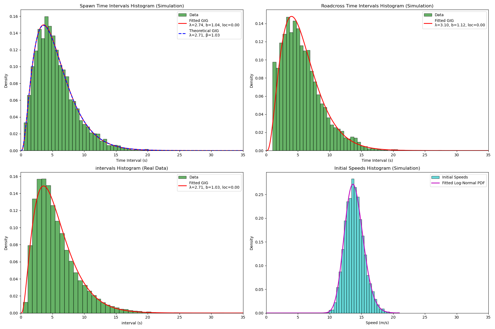
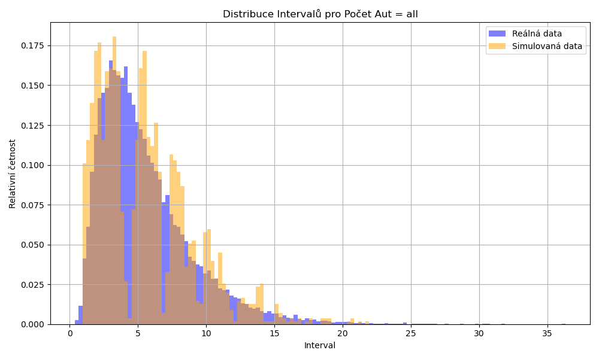
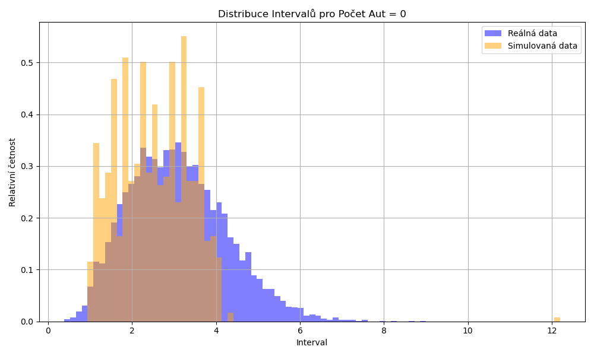
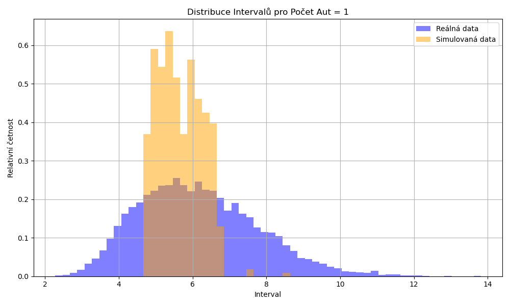
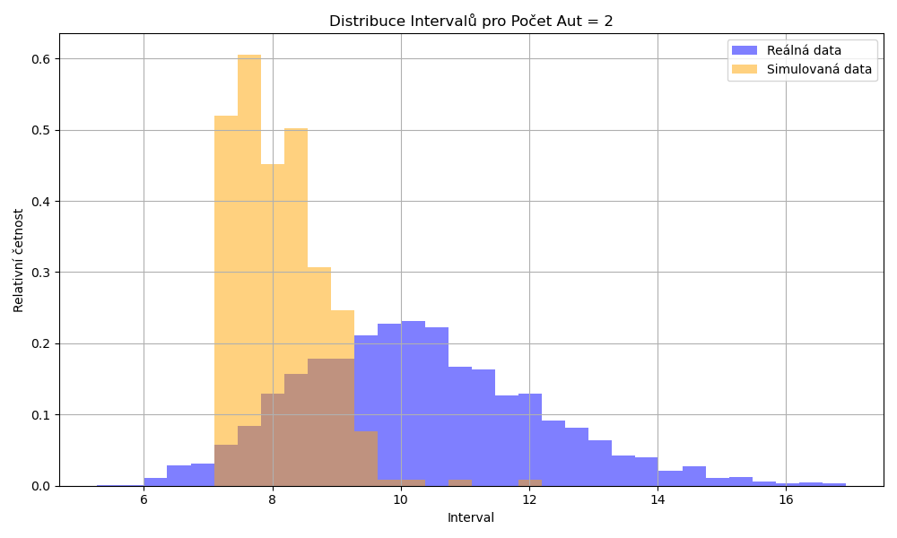

# Simulace křižovatky

# Úvod

Tato seminární práce se zaměřuje na simulaci dopravní křižovatky typu T pomocí Inteligentního řidičského modelu (IDM). Cílem simulace je nalézt vhodná počáteční rozdělení rychlostí a časových rozestupů mezi vozidly (při generování vozidel na začátku silnice) spolu s optimalizovanými parametry IDM, aby výsledné rozdělení časových intervalů průjezdů vozidel křižovatkou odpovídalo reálným datům získaným na mnichovské křižovatce. Reálná data z této křižovatky mám od profesora Krbálka. Tato data obsahují jak časové intervaly mezi průjezdy dvou po sobě jedoucích aut na hlavní silnici křižovatkou. Dále obsahují druhý sloupec, který říká, kolik aut z vedlejší silnice se do vzniklé mezery na hlavní silnici zařadilo. Dalším cílem je porovnat simulované počty zařazených vozidel do mezery mezi auty na hlavní silnici s reálnými počty zařazených aut.

## straight_line.py

Tento kód simuluje provoz na silnici pomocí modelu **IDM (Intelligent Driver Model)** a generování časových intervalů mezi vozidly dle **GIG (Generalized Inverse Gaussian)** a **log-normálního** rozdělení. Právě tato dvě rozdělení jsem zvolil, protože by měla odpovídat reálným situacím na pozemní komunikaci (často se předpokládá, že právě GIG rozdělení odpovídá rozdělení časových intervalů mezi jednotlivými průjezdy aut). Těmto dvoum rozdělením jsem na začátku nastavil i realistické parametry (hledat parametry IDM a i těchto dvou rozdělení by byl složitější a výpočetně náročnější úkol). Parametry GIG jsem volil na základě nafitovaného GIG rozdělení na reálná data z mnihovské křižovatky. Tyto parametry jsou **lambda = 2.71**, **beta = 1.03**, **loc = 0**. Parametry log-normálního rozdělení jsou nastaveny tak, aby byla střední hodnota rozdělení 50km/h a směrodatná odchylka 5.4km/h. Celý proces pak sbírá a vyhodnocuje data, jako např. časy mezi průjezdy (roadcross) či intervaly pro spawn nových aut - to pak slouží k optimalizaci IDM parametrů.

## Jak to zhruba funguje:

1. **Spuštění simulace**  
   - Načte se konfigurace (max. počet aut, délka silnice, parametry rozdělení atd.).
   - Vytvoří se instance simulace, připraví se okno (pokud je vizualizace zapnutá).

2. **Generování nových vozidel**  
   - V pravidelných intervalech (vzorkovaných z GIG rozdělení) se „spawnuje“ nové vozidlo.
   - Každé vozidlo získá **počáteční rychlost** z log-normálního rozdělení, aby měla auta různou vstupní rychlost.

3. **Aktualizace polohy a rychlosti vozidel**  
   - V každém simulačním kroku se vyhodnocuje akcelerace a brzdění na základě **IDM**, což zohledňuje:
     - Bezpečnostní rozestup od vozidla vepředu.
     - Omezení maximálního zrychlení a zpomalení.
   - Vozidla se posouvají po silnici, pokud nějaké přejede definovaný měřící bod (roadcross), dojde k zaznamenání jeho času.

4. **Ukončení simulace**  
   - Kód má dvě možné ukončení:
     - Buď dojedou všechna vozidla (nikdo už nezůstane před silničním bodem),
     - Nebo by došlo ke kolizi (kód umí tento scénář zachytit) - při rozumném nastavení parametrů rozdělení spawnů a parametrů IDM tento scénář nenastane.

5. **Vyhodnocení výsledků**  
   - Po skončení simulace (pokud není silent režim) proběhne:
     - Vykreslení grafů a histogramů pro časy mezi spawny vozidel, průjezdy měřícím bodem a počáteční rychlosti.
     - Porovnání s reálnými daty (dají se načíst z Excel souboru).
     - **Kolmogorov-Smirnov** testy pro kontrolu shody empirických dat s GIG/log-normální hypotézou. V případě KS testu reálných dat s GIG hypotézou dojde k jeho zamítnutí ačkoliv na základě vizuálního porovnání fitované GIG rozdělení velmi dobře aproximuje histogram. To si vysvětluji velkým množstvím dat (cca 23000 vzorků).
    

Vpravo nahoře vidíme histogram intervalů průjezdů aut křižovatkou (když se auta řídí IDM model s parametry nalezenými pomocí metody popsané v dalším odstavci). Je vidět, že nafitované parametry GIG na výsledky simulace jsou blízko parametrům GIG rozdělení nafitovaného na reálná data.

## Proces hledání optimálních parametrů IDM

**Co jednotlivé parametry znamenají?**

- **min_gap:**
  - Toto je minimální vzdálenost (v metrech), kterou chce řidič udržovat od vozidla před sebou, i když obě auta stojí. Odpovídá „osobnímu prostoru“, který řidič nechává při nízkých rychlostech nebo na semaforech.

- **max_acc:**
  - Maximální možné zrychlení (v metrech za sekundu na druhou), které může vozidlo dosáhnout nebo které je řidič ochoten využít. Reprezentuje, jak agresivně vozidlo dokáže zrychlovat v bezpečných podmínkách.

- **max_dec:**
  - Maximální (komfortní) zpomalení (v metrech za sekundu na druhou), které řidič nebo vozidlo použije. Odpovídá tomu, jak prudce může vozidlo brzdit, aniž by to bylo nekomfortní nebo nebezpečné.

- **react_time:**
  - Časová prodleva (v sekundách), během které řidič reaguje na změny v provozu (např. zpomalení vozidla před ním). Vyšší hodnota znamená, že řidič reaguje pomaleji.

- **desired_speed:**
  - Cílová cestovní rychlost (v metrech za sekundu), které chce řidič dosáhnout za optimálních podmínek. Reprezentuje rychlost, kterou by řidič preferoval na volné silnici.

- **delta:**
  - Tento exponent ovlivňuje, jak rychle se mění akcelerace vozidla v závislosti na vzdálenosti a relativní rychlosti. V modelu IDM bývá hodnota kolem 4. Vyšší hodnota znamená, že model je citlivější na změny ve vzdálenosti a rychlosti, což může vést k agresivnějším nebo naopak opatrnějším reakcím.

Výše popsaný straight_line.py pak slouží k jednotlivým simulacím, které jsou volány v kódu **config_parameters.py**. Tento kód pomocí Grid search algoritmu hledá optimální parametry IDM (**min_gap**,**max_acc**,**max_dec**,**react_time**,**desired_speed**,**delta**) s cílem minimalizovat metriku chi-kvadrát (mezi dvěma histogramy) - metrika podobnosti dvou rozdělení. Cílem je aby při daném počátečním rozdělení rychlostí, intervalů spawnu aut a optimalizovanými parametry IDM bylo rozdělení intervalů průjezdů aut na konci silnice (po 300 metrech) stejné, jako bylo naměřeno na mnichovské křižovatce. Tímto způsobem jsem vygeneroval závislost chi-kvadrát metriky na různých (do mřížky uspořádaných) volbách parametrů IDM. Simulace pro danou volbu parametrů proběhla pětkrát a uložil se průměr ze všech pěti chi-kvardát hodnot. Simulace běžela paralelně na 16 výpočetních uzlech Intel XEON Gold 6134@3.2GHz CPU na FJFI HELIOS clusteru. Zkoušel jsem s využitím metod regresní analýzy určit vyhodný polynom, který by aproximoval logaritmicky tranformovanou chi-kvadrát metriku závislou na mocninách regresorů (parametrů), tento polynom jsem pak minimalizoval. Bohužel z důvodu vysokého počtu regresorů (overfitingu) (= kolem 5000) byl interval predikce příliš široký a nalezené parametry IDM, které by minimalizovali tuto metriku v praxi, měly hodnotu metriky vyšší, než je minimální naměřená hodnota z Grid search. Zkoušel jsem také udělat Stepwise selection regresorů, ale trvalo to příliš dlouho. Řekl jsem si, že tudy cesta nevede a jako optimální parametry IDM jsem zvolil ty, které měly ve výsledku Grid search algoritmu nejnižší hodnotu průměrné chi-kvadrát metriky. Tyto optimální parametry IDM jsou: 

- min_gap = 1.625
- max_acc = 2
- max_dec = 4
- react_time = 0.3
- desired_speed = 19.44
- delta = 2

hodnota průměrné chi-kvadrát byla pro tuto volbu rovna 0.0139. Výsledek Grid search, ze kterého jsem tyto hodnoty čerpal je uložen v **data/IDM_parameters.xlsx**.

**Celkem tedy:** Když zvolíme parametry IDM tímto způsobem, tak při takto zvoleném rozdělení počátečních rychlostí a intervalů spawnů aut, po 300 metrech mají časové intervaly průjezdů aut křižovatkou rozdělení velmi podobné tomu, které bylo naměřeno na mnichovské křižovatce.

## T_cross_new.py

Tento kód už implementuje křižovatku typu T. Předpokládá, že na hlavní silnici jedou auta a do mezer mezi nimi se připojují auta z vedlejší silnice. Parametry IDM celé simulace odpovídají těm, které byly nalezeny jako optimální v předešlém kódu. Jediný rozdíl je v desired speed na vedlejší silnici, ta je nastavena na 50km/h = 13.88m/s (oproti 70km/h = 19.44m/s na hlavní silnici). Na obou silnicích jsou auta spawnování s rychlostí vygenerovanou z log-normálního rozdělení, ale s odlišnými parametry a také intervaly mezi spawny aut jsou generovány z GIG rozdělení, ale s odlišnými parametry. Ovšem parametry GIG rozdělení a log-normálního rozdělení odpovídají těm, které byly použity v simulaci straight_line.py dříve. Také křižovatka je umístěna na hlavní silni přesně 300 metrů od začátku hlavní silnice (stejně jako v straight_line.py). 

### Zařazování aut z vedlejší silnice

Tento proces probíhá na základě bezpečné mezery mezi vozidly na hlavní silnici.

1. **Zpomalení při přibližování ke křižovatce**
- Červená auta (z vedlejší silnice) se přibližují ke křižovatce a začínají postupně zpomalovat.
- Zpomalení začíná 50 metrů před křižovatkou, kde se cílová rychlost snižuje z 50 km/h na 10 km/h. Během této doby už kontroluje, zda je na hlavní volná mezera.
- Pokud auto nemá volno k zařazení, pokračuje v postupném zpomalování.

2. **Kontrola mezery na hlavní silnici**
- Když červené auto dosáhne křižovatky, ověřuje se, zda je dostatečná mezera pro bezpečné zařazení.
- Kontrola probíhá podle:
  - **Vzdálenosti auta před křižovatkou k nejbližšímu autu na hlavní silnici** (gap ahead).
  - **Vzdálenosti auta za křižovatkou k nejbližšímu autu na hlavní silnici** (gap behind - bere v potaz i rozdíl rychlostí lag_car a čekajícího auta na vedlejší silnici).

3. **Zařazení na hlavní silnici**
- Pokud je mezera dostatečná, auto:
  - Změní barvu na modrou (je zařazeno na hlavní silnici).
  - Dostane parametry hlavní silnice (vyšší rychlost, jiný model chování).
  - Pokračuje v jízdě na hlavní silnici.
- Pokud není mezera dostatečná:
  - Auto čeká na volno a zůstává u křižovatky na nízké rychlosti.

4. **Sledování dat o zařazení**
- Po každém úspěšném zařazení se zaznamená:
  - Počet aut, která se zařadila na hlavní silnici z vedlejší silnice.
  - Časový odstup mezi dvěma průjezdy modrých aut křižovatkou.
- Tato data se ukládají do CSV souboru a lze je použít pro porovnání s reálnými daty.

## Porovnání reálných dat z T křižovatky a simulace

Naměřená data časových intervalů mezi průjezdy aut na hlavní a počet aut, které se do mezery zařadilo z vedlejší jsou pak analyzována a porovnána s reálnými daty v kódu merging_data_analysis.py. Data z obou souborů jsou rozdělena do kategorií podle počtu zařazených aut. Dvě sobě příslušející kategorie z obou souborů jsou porovnány. Testuje se podobnost rozdělení dvou výběrů (časových intervalů průjezdů aut na hlavní silnici) v rámci dané kategorie pomocí Kolmogorov-Smirnov GoF testu. Tímto způsobem se vyhodnotí všechny kategorie. Ve všech kategoriích byla nulová hypotéza zamítnuta. Pomocí KS GoF testu byly vyhodnoceny také celé výběry intervalů průjezdů z reálných dat a simulace, tento test byl ale také zamítnut, přestože na základě vizuálního porovnání jsou si histogramy poměrně blízké. Následuje histogram intervalů průjezdů křižovatkou z reálných dat a z dat naměřených v simulaci. Pak histogramy průjezdů křižovatkou z reálných dat a z dat naměřených v simulaci když se do mezery zařadí 0 aut, jedno auto a dvě auta. Lze pozorovat že na simulovaná data mají užší histogram a s rostoucím počtem zařazených aut se histogram posouvá vlevo.

Pokud bych měl simulaci vylepšit, tak se zaměřím na zlepšení logiky zařazování aut z vedlejší silnice. Reálná data a data naměřená ze simulace jsou uloženy ve složce **data** pod názvy **real_data.xlsx** a **simulation_data.csv**.

## cluster

Složka obsahuje soubory, které sloužily k simulaci na školním FJFI HELIOS clusteru.

## ChatGPT

Kódy byly vytvářeny také s pomocí jazykových modelů ChaGPT 4o, ChatGPT o1-mini a ChatGPT o1.

